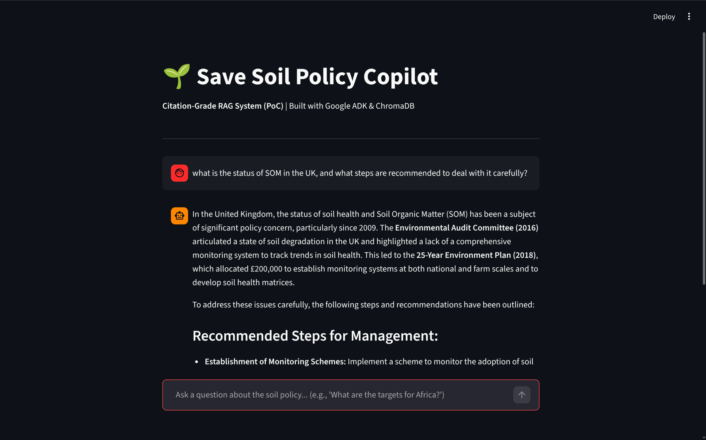
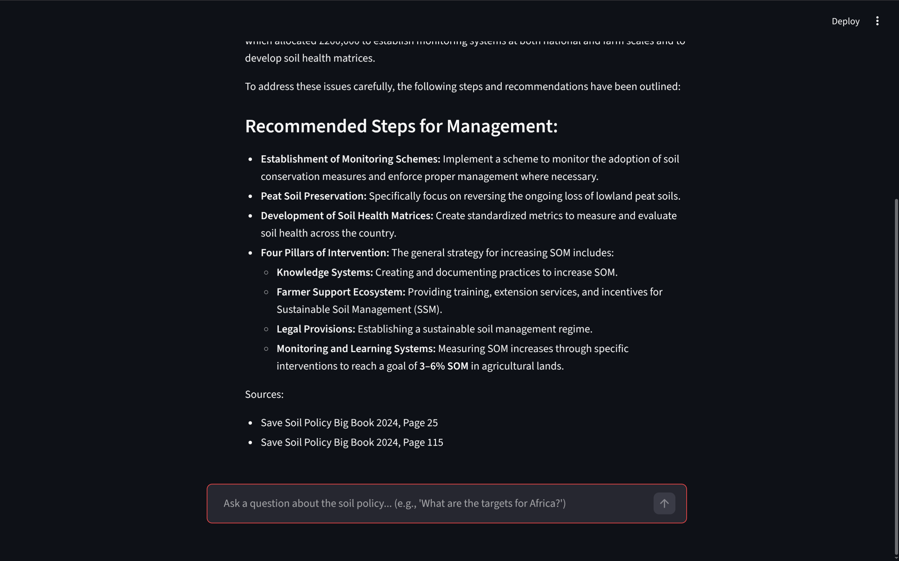

# 🌱 Save Soil Policy Copilot (RAG PoC)

An enterprise-grade, Retrieval-Augmented Generation (RAG) Proof of Concept designed to extract and synthesize actionable insights from dense, unstructured environmental policy documents.




Built to demonstrate **citation-grade grounding**, **metadata-aware vector retrieval**, and **hallucination prevention** using modern Agentic AI frameworks.

## 🏗️ Architecture & Tech Stack

* **Orchestration:** [Google Agent Development Kit (ADK)](https://github.com/google/agent-development-kit) for LLM routing and tool execution.
* **Vector Database:** [ChromaDB](https://www.trychroma.com/) for local, persistent semantic storage.
* **Embeddings:** `all-MiniLM-L6-v2` via SentenceTransformers for fast, lightweight text vectorization.
* **Frontend UI:** Streamlit with asynchronous streaming capabilities.
* **Environment:** Managed via `uv` for lightning-fast dependency resolution.

## ✨ Core Engineering Features

1.  **Citation-Grade Grounding:** The LLM is strictly prompted to append exact source metadata (Document Title and Page Number) to every synthesized fact.
2.  **ETL Pagination Syncing:** The ingestion pipeline (`ingest.py`) actively calculates offset logic to sync the absolute PDF index with the printed document pagination, ensuring citations are accurate for human verification.
3.  **Explicit Uncertainty (Hallucination Prevention):** The retrieval tool is designed to return a specific failure flag if no relevant vectors are found, forcing the LLM to state explicitly that it lacks the data rather than guessing.
4.  **Asynchronous Streaming:** The UI leverages the ADK's `InMemorySessionService` and `run_async` generators to stream responses to the frontend in real-time.

## 🚀 Quick Start (Local Deployment)

**1. Clone the repository and set up the environment:**
```bash
git clone [https://github.com/yourusername/save-soil-copilot.git](https://github.com/yourusername/save-soil-copilot.git)
cd save-soil-copilot
uv venv
source .venv/bin/activate  # On Windows: .venv\Scripts\activate
uv pip install -r requirements.txt
